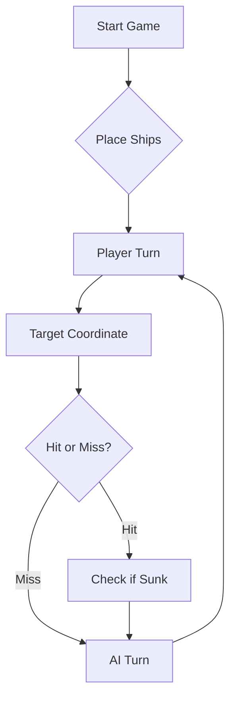

# ⚓ Battleship 2.0


> A modern take on the classic naval warfare game, designed for the XVII century setting with updated software engineering patterns.

---

## 📖 Table of Contents
- [Project Overview](#-project-overview)
- [Key Features](#-key-features)
- [Technical Stack](#-technical-stack)
- [Installation & Setup](#-installation--setup)
- [Code Architecture](#-code-architecture)
- [Roadmap](#-roadmap)
- [Contributing](#-contributing)
- https://youtu.be/RS31wMh_lXI -> Link para video da Parte B do enunciado
- https://youtu.be/YwQsVAAg5B8 -> Link para vídeo da Parte D do enunciado

---

## 🎯 Project Overview
This project serves as a template and reference for students learning **Object-Oriented Programming (OOP)** and **Software Quality**. It simulates a battleship environment where players must strategically place ships and sink the enemy fleet.

### 🎮 The Rules
The game is played on a grid (typically 10x10). The coordinate system is defined as:

$$(x, y) \in \{0, \dots, 9\} \times \{0, \dots, 9\}$$

Hits are calculated based on the intersection of the shot vector and the ship's bounding box.

---

## ✨ Key Features
| Feature | Description | Status |
| :--- | :--- | :---: |
| **Grid System** | Flexible $N \times N$ board generation. | ✅ |
| **Ship Varieties** | Galleons, Frigates, and Brigantines (XVII Century theme). | ✅ |
| **AI Opponent** | Heuristic-based targeting system. | 🚧 |
| **Network Play** | Socket-based multiplayer. | ❌ |

---

## 🛠 Technical Stack
* **Language:** Java 17
* **Build Tool:** Maven / Gradle
* **Testing:** JUnit 5
* **Logging:** Log4j2

---

## 🚀 Installation & Setup

### Prerequisites
* JDK 17 or higher
* Git

### Step-by-Step
1. **Clone the repository:**
   ```bash
   git clone [https://github.com/britoeabreu/Battleship2.git](https://github.com/britoeabreu/Battleship2.git)
   ```
2. **Navigate to directory:**
   ```bash
   cd Battleship2
   ```
3. **Compile and Run:**
   ```bash
   javac Main.java && java Main
   ```

---

## 🤖 Prompt Final de Estratégia e IA (Few-Shot Prompting)

Para treinar o nosso oponente de Inteligência Artificial, desenvolvemos o seguinte *prompt* que engloba as regras do jogo, o protocolo de comunicação via JSON e a estratégia de combate utilizando a técnica de *few-shot prompting*:

> Atua como um Almirante perito no jogo da Batalha Naval (Descobrimentos Portugueses).
> 
> **AS REGRAS E A FROTA:**
> O tabuleiro tem 10x10 (Linhas A-J, Colunas 1-10). A frota inimiga tem 11 navios: 4 Barcas (1 pos), 3 Caravelas (2 pos), 2 Naus (3 pos), 1 Fragata (4 pos) e 1 Galeão (5 pos em formato "T"). Os navios nunca se tocam, nem sequer nas diagonais.
> 
> **A TÁTICA (DIÁRIO DE BORDO):**
> 1. Nunca repitas tiros nem atires fora do tabuleiro.
> 2. Se atingires um navio, os teus próximos tiros devem ser nas posições contíguas (Norte, Sul, Este, Oeste) para o afundar.
> 3. Evita atirar nas diagonais de navios atingidos (exceto no Galeão), pois os navios são linhas retas e não se tocam.
> 4. Quando afundares um navio, marca mentalmente um "halo" de 1 quadrícula à volta de toda a carcaça como água. Não atires para aí.
> 
> **O PROTOCOLO DE COMUNICAÇÃO:**
Deves enviar a tua resposta seguindo obrigatoriamente esta estrutura, sem nunca exceder os 3 tiros:

Linha de Comando: Escreve exatamente 3 coordenadas separadas por um único espaço (ex: A1 B5 G3). Não uses vírgulas, aspas ou parêntesis nesta linha. Eu vou copiar esta linha para o meu terminal.

Bloco JSON: Logo abaixo, envia o array JSON com os mesmos 3 tiros no formato {"row": "A", "column": 1}.
> 
> **EXEMPLOS DE PENSAMENTO E RESPOSTA (FEW-SHOT):**
> 
> *Exemplo 1 - Tiro na água:*
> Input: "Rajada anterior [A1, A2, A3]. Resultado: 3 tiros na água."
> O teu raciocínio interno: "Vou procurar noutra zona do tabuleiro, dando espaço."
> A tua resposta JSON:
> C5 F8 I2
> [
>   {"row": "C", "column": 5},
>   {"row": "F", "column": 8},
>   {"row": "I", "column": 2}
> ]
> 
> *Exemplo 2 - Caça ao alvo:*
> Input: "Rajada anterior [C5, F8, I2]. Resultado: 1 tiro na Nau (em C5), 2 na água."
> O teu raciocínio interno: "Atingi a Nau em C5. Os meus próximos tiros têm de ser adjacentes a C5 (C4, C6, B5 ou D5)."
> A tua resposta JSON:
> C4 C6 B5
> [
>   {"row": "C", "column": 4},
>   {"row": "C", "column": 6},
>   {"row": "B", "column": 5}
> ]
> 
> *Exemplo 3 - Navio Afundado:*
> Input: "Rajada anterior [C4, C6, B5]. Resultado: Nau afundada (ocupava C4, C5, C6)."
> O teu raciocínio interno: "Nau afundada. As linhas B e D (colunas 3 a 7) e as posições C3 e C7 são água garantida. Vou atirar noutra zona livre."
> A tua resposta JSON:
> H7 H9 J8
> [
>   {"row": "H", "column": 7},
>   {"row": "H", "column": 9},
>   {"row": "J", "column": 8}
> ]
>
> **O JOGO COMEÇA AGORA:** > Envia a tua primeira rajada às cegas.

## 📚 Documentation

You can access the generated Javadoc here:

👉 [Battleship2 API Documentation](https://britoeabreu.github.io/Battleship2/)


### Core Logic
```java
public class Ship {
    private String name;
    private int size;
    private boolean isSunk;

    // TODO: Implement damage logic
    public void hit() {
        // Implementation here
    }
}
```

### Design Patterns Used:
- **Strategy Pattern:** For different AI difficulty levels.
- **Observer Pattern:** To update the UI when a ship is hit.
</details>

### Logic Flow


---

## 🗺 Roadmap
- [x] Basic grid implementation
- [x] Ship placement validation
- [ ] Add sound effects (SFX)
- [ ] Implement "Fog of War" mechanic
- [ ] **Multiplayer Integration** (High Priority)

---

## 🧪 Testing
We use high-coverage unit testing to ensure game stability. Run tests using:
```bash
mvn test
```

> [!TIP]
> Use the `-Dtest=ClassName` flag to run specific test suites during development.

---

## 🤝 Contributing
Contributions are what make the open-source community such an amazing place to learn, inspire, and create.

1. Fork the Project
2. Create your Feature Branch (`git checkout -b feature/AmazingFeature`)
3. Commit your Changes (`git commit -m 'Add some AmazingFeature'`)
4. Push to the Branch (`git push origin feature/AmazingFeature`)
5. Open a **Pull Request**

---

## 📄 License
Distributed under the MIT License. See `LICENSE` for more information.

---
**Maintained by:** [@britoeabreu](https://github.com/britoeabreu)  
*Created for the Software Engineering students at ISCTE-IUL.*
